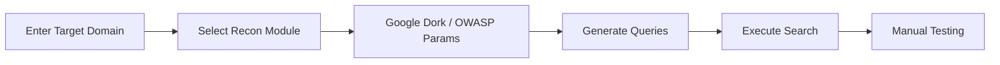

<div align="center">

# 🕵️‍♂️ SurfaceHunter

### Advanced OSINT & Reconnaissance Automation Platform

[](LICENSE)
[](#)
[](#)
[](#)

**A powerful browser-based reconnaissance tool for penetration testers, bug bounty hunters, and security researchers.**

[🚀 Live Demo](https://dharmendrastm.github.io/GoogleDork/) • [📖 Documentation](#-how-it-works) • [🤝 Contribute](#-contributing)

---


</div>

---

## 📋 Table of Contents

- [Overview](#-overview)
- [Key Features](#-key-features)
- [How It Works](#-how-it-works)
- [Technology Stack](#-technology-stack)
- [Getting Started](#-getting-started)
- [Use Cases](#-use-cases)
- [Roadmap](#-roadmap)
- [Contributing](#-contributing)
- [Legal Disclaimer](#%EF%B8%8F-legal-disclaimer)
- [License](#-license)
- [Author](#-author)

---

## 🎯 Overview

**SurfaceHunter** automates the reconnaissance phase of security assessments by eliminating manual Google Dorking and parameter hunting. Built for efficiency and ease of use, it accelerates the discovery of hidden attack surfaces across web applications.

### Why SurfaceHunter?

Reconnaissance is the **foundation** of every successful security assessment. Instead of manually crafting hundreds of Google queries, SurfaceHunter provides:

- ✅ **250+ Pre-built Google Dorks** across 24+ vulnerability categories
- ✅ **OWASP Top-25 Parameter Discovery** with 150+ high-risk patterns
- ✅ **Zero Configuration** — Works directly in your browser
- ✅ **Bug Bounty Optimized** — Professional recon workflow
- ✅ **Educational Resource** — Learn OSINT & reconnaissance techniques

> ⚠️ **Note:** This tool performs reconnaissance only. It does NOT exploit vulnerabilities.

---

## ✨ Key Features

### 🔍 Advanced Google Dork Engine

Discover hidden assets with **250+ curated Google Dorks** covering:

<details>
<summary><b>24+ Vulnerability Categories</b> (Click to expand)</summary>

- 🔐 Admin & Login Panels
- 💉 SQL Injection (SQLi)
- 🎯 Cross-Site Scripting (XSS)
- 📁 Local File Inclusion (LFI)
- 🌐 Server-Side Request Forgery (SSRF)
- ↪️ Open Redirect
- 💾 Backup & Configuration Files
- 🗄️ Exposed Databases
- 🔌 API Endpoints & Documentation
- ☁️ Cloud Storage Buckets (AWS S3, Azure, GCP)
- 🔧 Git Repositories & Version Control
- 📂 Directory Listings
- 🔌 WordPress Security Issues
- 🐛 Debug & Error Pages
- 🔑 Sensitive Files (`.env`, `.log`, `.bak`, `.sql`)
- 📊 Analytics & Tracking Scripts
- 🎫 Session Tokens & Credentials
- 📱 Mobile App Endpoints
- 🔐 Authentication Bypass Vectors
- And many more...

</details>

---

### 🛡️ OWASP Top-25 Parameter Scanner

Hunt vulnerable parameters with **150+ high-risk patterns** mapped to:

| Vulnerability Type | Example Parameters |
|-------------------|-------------------|
| 🌐 **SSRF** | `url=`, `uri=`, `path=`, `dest=` |
| 📁 **LFI** | `file=`, `document=`, `folder=`, `pg=` |
| 💉 **SQL Injection** | `id=`, `user=`, `product=`, `cat=` |
| ↪️ **Open Redirect** | `redirect=`, `return=`, `next=`, `goto=` |
| 🎯 **XSS** | `q=`, `search=`, `keyword=`, `query=` |
| ⚡ **RCE** | `cmd=`, `exec=`, `command=`, `ping=` |

---

### ⚡ Professional Recon Workflow

- **Severity Classification:** 🟢 Low • 🟡 Medium • 🟠 High • 🔴 Critical
- **One-Click Search:** Automated Google query execution
- **Copy-Paste Ready:** Instant query generation
- **Cyber-Themed UI:** Professional, hacker-aesthetic interface
- **Real-Time Results:** No backend, no delays

---

### 🌐 Fully Client-Side Architecture

- ✅ **No Backend Required** — Pure client-side JavaScript
- ✅ **No API Keys Needed** — Direct browser execution
- ✅ **Privacy First** — Zero data collection
- ✅ **Instant Deployment** — GitHub Pages compatible
- ✅ **Cross-Platform** — Works on any modern browser

---

## 🧠 How It Works

### Step-by-Step Workflow



### 1️⃣ **Enter Target Domain**

```plaintext
Example: testphp.vulnweb.com
```

### 2️⃣ **Select Recon Module**

Choose from:
- 🔍 **Google Dork Categories** (Admin Panels, SQLi, XSS, etc.)
- 🛡️ **OWASP Parameter Scanner** (SSRF, LFI, Open Redirect, etc.)

### 3️⃣ **Automated Query Generation**

SurfaceHunter generates optimized Google queries:

```plaintext
site:example.com inurl:login
site:example.com inurl:id=
site:example.com filetype:env
site:example.com inurl:admin intitle:"login"
```

### 4️⃣ **Manual Testing Phase**

Use discovered assets with:
- 🔧 **Burp Suite** — Intercept & modify requests
- 🌐 **Browser DevTools** — Analyze responses
- 💉 **Payload Injection** — Test for vulnerabilities
- 🧪 **Business Logic Testing** — Manual verification

---

## 🛠️ Technology Stack

### Frontend Technologies

| Technology | Purpose |
|-----------|---------|
| **HTML5** | Semantic structure & accessibility |
| **CSS3** | Cyberpunk UI, neon effects, animations |
| **Vanilla JavaScript** | Dynamic rendering & automation |

### Design & UX

- 🎨 **Google Fonts** — Orbitron, JetBrains Mono
- 🎭 **Font Awesome** — Professional iconography
- 🌌 **Canvas API** — Animated Matrix-style background

### Security Concepts

**Google Search Operators:**
```plaintext
site:     # Restrict to specific domain
inurl:    # Search within URL
intitle:  # Search page titles
filetype: # Find specific file types
```

**OWASP Testing Guide Integration:**
- Parameter fuzzing patterns
- Common vulnerability vectors
- Real-world bug bounty techniques

---

## 🚀 Getting Started

### Quick Start (3 Steps)

1. **Visit the Live Demo**
   ```
   https://dharmendrastm.github.io/GoogleDork/
   ```

2. **Enter Your Target Domain**
   ```
   example.com
   ```

3. **Start Hunting**
   - Select a dork category
   - Click "Search Google"
   - Analyze results

### Self-Hosting (GitHub Pages)

```bash
# Fork this repository
git clone https://github.com/dharmendrastm/GoogleDork.git
cd GoogleDork

# Enable GitHub Pages
# Settings → Pages → Source: main branch

# Your instance will be live at:
# https://yourusername.github.io/GoogleDork/
```

### Local Development

```bash
# Clone the repository
git clone https://github.com/dharmendrastm/GoogleDork.git
cd GoogleDork

# Open in browser
open index.html
# or
python -m http.server 8000
```

---

## 💼 Use Cases

### For Penetration Testers
- Accelerate reconnaissance phase
- Discover forgotten subdomains
- Find exposed admin panels
- Identify configuration errors

### For Bug Bounty Hunters
- Uncover hidden endpoints
- Hunt vulnerable parameters
- Discover sensitive file exposures
- Optimize recon workflow

### For Security Students
- Learn OSINT techniques
- Understand Google Dorking
- Practice reconnaissance methodology
- Build portfolio projects

### For Red Teamers
- Initial access research
- Target profiling
- Asset discovery
- Attack surface mapping

---

## 🛣️ Roadmap

### Upcoming Features

- [ ] **Wayback Machine Integration** — Historical URL discovery
- [ ] **Subdomain Enumeration** — Automated subdomain finder
- [ ] **Parameter Brute-Force** — Custom wordlist support
- [ ] **Export Functionality** — CSV/TXT/JSON reports
- [ ] **Recon Notes System** — Built-in note-taking
- [ ] **CVSS Integration** — Severity scoring
- [ ] **Dark Mode Toggle** — UI customization
- [ ] **Multi-Target Support** — Batch domain scanning
- [ ] **API Rate Limiting** — Respect search quotas
- [ ] **Custom Dork Builder** — User-defined queries

### Long-Term Vision

- Browser extension version
- Mobile app (PWA)
- Integration with Burp Suite/OWASP ZAP
- Community dork database
- AI-powered query optimization

---

## 🤝 Contributing

Contributions make the open-source community thrive! Here's how you can help:

### Ways to Contribute

1. **⭐ Star this repository** — Show your support
2. **🍴 Fork & improve** — Add new features
3. **🐛 Report bugs** — Help us improve
4. **💡 Suggest ideas** — Feature requests welcome
5. **📝 Improve docs** — Better documentation

### Contribution Ideas

- Add new Google Dork categories
- Expand OWASP parameter lists
- UI/UX enhancements
- Performance optimizations
- Internationalization (i18n)
- Accessibility improvements

### How to Contribute

```bash
# 1. Fork the repository
# 2. Create your feature branch
git checkout -b feature/AmazingFeature

# 3. Commit your changes
git commit -m 'Add some AmazingFeature'

# 4. Push to the branch
git push origin feature/AmazingFeature

# 5. Open a Pull Request
```

---

## ⚖️ Legal Disclaimer

### 🚨 READ CAREFULLY

This tool is intended **ONLY** for:
- ✅ Educational purposes
- ✅ Authorized security testing
- ✅ Legal penetration testing engagements
- ✅ Bug bounty programs with explicit permission

### ❌ Prohibited Use

**DO NOT use this tool:**
- Without explicit written authorization
- Against systems you don't own or have permission to test
- For any illegal activities
- To cause harm or disruption

### Legal Responsibility

- **Unauthorized access is illegal** in most jurisdictions
- You are solely responsible for your actions
- The developer assumes **NO LIABILITY** for misuse
- Always obtain **written permission** before testing
- Follow responsible disclosure practices

> **🔐 Use ethically. Test responsibly. Hack legally.**

---

## 📜 License

This project is licensed under the **MIT License** — see the [LICENSE](LICENSE) file for details.

```plaintext
MIT License

Copyright (c) 2025 Dharmendra Kumar

Permission is hereby granted, free of charge, to any person obtaining a copy
of this software and associated documentation files (the "Software"), to deal
in the Software without restriction, including without limitation the rights
to use, copy, modify, merge, publish, distribute, sublicense, and/or sell
copies of the Software...
```

---

## 👨‍💻 Author

<div align="center">

### Dharmendra Kumar

**Penetration Tester | Security Researcher | OSINT Enthusiast**

[](https://www.linkedin.com/in/dharmendrastm/)
[](https://github.com/dharmendrastm)

**Also known as:** `dharmendrahacker` • `dharmendracyberhack`

---

### 💬 Let's Connect

Have questions? Want to collaborate? Reach out!

📧 **Professional inquiries:** [LinkedIn](https://www.linkedin.com/in/dharmendrastm/)  
🐛 **Bug reports:** [GitHub Issues](https://github.com/dharmendrastm/GoogleDork/issues)  
💡 **Feature requests:** [Discussions](https://github.com/dharmendrastm/GoogleDork/discussions)

</div>

---

## 🌟 Acknowledgments

- **OWASP Foundation** — For security testing guidelines
- **Bug Bounty Community** — For reconnaissance best practices
- **Open Source Contributors** — For making security accessible

---

<div align="center">

### 🔥 Made with ❤️ by Dharmendra Kumar

**SurfaceHunter — Hunt the Attack Surface, Not the Vulnerabilities**

[](https://github.com/dharmendrastm/GoogleDork/stargazers)
[](https://github.com/dharmendrastm)

---

**If this project helped you, consider giving it a ⭐**

**© 2025 SurfaceHunter | All Rights Reserved**

</div>

---

<div align="center">

### 🛡️ Security Notice

Found a security issue? Please report responsibly via [private disclosure](https://github.com/dharmendrastm/GoogleDork/security/advisories/new).

</div>
